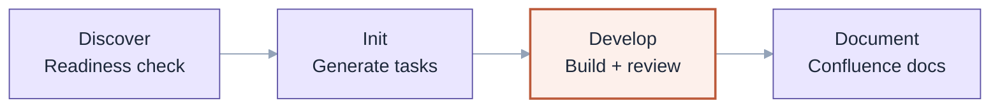
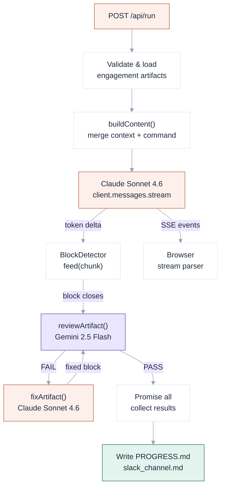

The peer reviewer in our system is not a different prompt. It is a different model, routed to a separate API endpoint, with a system prompt written to refute rather than produce. That single decision changes what gets caught — and why.

Here is the architecture, with the reasoning behind each part.

## The Platform

`vivanti-adp` is a structured knowledge base that Claude Code reads at session start. It encodes Vivanti's delivery methodology as machine-readable files: six agent role definitions, reusable skill workflows, engagement contexts (data contract, repos config, client stack notes), domain knowledge playbooks, a memory system, and automation hooks.

`adp-runner` lives inside `vivanti-adp` as the command center — a Next.js web app that makes the `develop` step runnable in a browser. You give it a command and an engagement name. It reads everything relevant from `vivanti-adp` at runtime and runs a streaming multi-agent loop.

The delivery lifecycle has four commands:



`adp-runner` runs the `develop` step. The others run via Claude Code directly inside `vivanti-adp`.

## What the Develop Step Does

The per-task cycle has seven steps, in order:

1. **Start** — read `PROGRESS.md` for idempotency; skip any task marked `HANDOVER` or `DONE`; pick the next eligible task from `tasks.md` by dependency order
2. **Load craft** — load the owning agent file, the contract sections that agent requires, and any applicable `knowledge/domain/` playbooks; check `memory/patterns/promoted-patterns.md` for recurring issues from prior sessions
3. **Build** — generate artefacts; branch naming follows `{type}/{scope}/{description}` from `repos.yml`; run local validation (`terraform validate` / `dbt parse` / `sqlfluff`)
4. **First PR** — commit, push, raise the PR against the target branch from `repos.yml`
5. **Independent review** — hand the artefact to the peer reviewer (separate model, adversarial system prompt)
6. **Fix** — address every finding or record an explicit won't-fix; re-run local checks; push fixes to the same branch
7. **Handover** — mark PR ready for human review; transition Jira issue to *In Review*; **stop**

The agent never merges. One task = one branch = one PR. The rule is enforced by `branch-guard.sh` as a pre-tool hook.

## Inside the API Route

The backend is a single Next.js API route — 539 lines, no database, no queue, no microservices.

On every POST request it:

1. Validates the engagement name against `/^[a-z0-9_-]+$/` — no path traversal
2. Loads server-side artifacts: `tasks.md`, `PROGRESS.md`, and `memory/patterns/promoted-patterns.md` if they exist
3. Assembles the full context with `buildContent()` — merging the three uploaded files (context, contract, repos) with the server-loaded artifacts and the command instruction loaded from `.claude/commands/ude/{command}.md`
4. Opens a `ReadableStream` emitting SSE events to the browser
5. Spawns the main agent stream and pipes `BlockDetector` over it concurrently



The SSE stream sends `{ type: 'text', content }` events for streamed tokens, `{ type: 'done' }` on completion, and `{ type: 'error', message }` on failure.

## Why Different Models

The main agent is Claude Sonnet 4.6 via the Anthropic SDK. The peer reviewer is Gemini 2.5 Flash via an OpenAI-compatible LLM gateway (`LLM_GATEWAY_URL`, `LLM_GATEWAY_KEY`).

A reviewer sharing the generator's training distribution does not provide adversarial distance — it replays the same failure modes. Routing to a different model family means different pretraining data, different RLHF signal, different tendencies. The reviewer's system prompt reinforces the distance:

> You are a senior data engineer reviewing a teammate's PR. You're direct, you find real problems, and you write like a person — not a system.

Its output format is machine-parseable:

```
[VERDICT: PASS | PASS WITH NOTES | FAIL]

[CRITICAL] phone_number VARCHAR(15) — exceeds contract maximum of VARCHAR(20)
[MAJOR] aurora_contacts missing dedup key — required per contract section 4.2
[MINOR] Missing load_ts audit column
```

The runner parses verdict and severity counts from the raw text. `CRITICAL` count drives escalation decisions. `MINOR` findings land in the audit log without blocking the cycle.

## BlockDetector: Concurrent Review During Generation

Naive sequencing: generate fully, then review. Wall-clock cost: generation time + review time.

`BlockDetector` breaks that sequence. It feeds on the token stream as it arrives, watching for triple-backtick boundaries:

```ts
class BlockDetector {
  private lineBuf = ''
  private inBlock = false
  private blockLines: string[] = []

  feed(text: string): void {
    const combined = this.lineBuf + text
    const lines = combined.split('\n')
    this.lineBuf = lines.pop() ?? ''
    for (const line of lines) {
      if (!this.inBlock && line.trimStart().startsWith('```')) {
        this.inBlock = true
        this.blockLines = [line]
      } else if (this.inBlock) {
        this.blockLines.push(line)
        if (line.trim() === '```') {
          this.inBlock = false
          this.onBlock(this.blockLines.join('\n'))
          this.blockLines = []
        }
      }
    }
  }
}
```

The instant a block closes, the callback fires an async IIFE that pushes a `Promise<ReviewResult>` into the pending array. The main stream continues. After `stream.finalMessage()`, `await Promise.all(pendingReviews)` collects every result.

If the main agent produces five blocks, blocks one through four are in peer review concurrently while block five is still being written. On a typical develop run — three to five blocks per task — this saves 30–60 seconds against sequential review.

## Smart Artefact Naming

Before a block goes to the reviewer, it needs a name. `blockName()` tries five extraction strategies in order:

```ts
function blockName(block: string, seq: number): string {
  // 1. Filename comment: -- contacts_raw.sql / # pipeline.py
  const firstContent = block.split('\n')[1] ?? ''
  const commentMatch = firstContent.match(
    /--\s*(\S+\.sql)|#\s*(\S+\.(?:py|yml|yaml))|\/\/\s*(\S+\.\w+)/
  )
  if (commentMatch) return commentMatch[1] ?? commentMatch[2] ?? commentMatch[3]

  // 2. SQL DDL — CREATE TABLE / VIEW / PROCEDURE / TASK / STREAM
  const ddlMatch = block.match(
    /CREATE(?:\s+OR\s+REPLACE)?(?:\s+TRANSIENT)?\s+(?:TABLE|VIEW|PROCEDURE|TASK|STREAM)\s+(?:[\w$]+\.)*?([\w$]+)\s*[(\n]/i
  )
  if (ddlMatch) return `${ddlMatch[1].toLowerCase()}.sql`

  // 3. SQL DML — INSERT / MERGE target
  const dmlMatch = block.match(
    /(?:INSERT\s+(?:INTO\s+)?|MERGE\s+INTO\s+)(?:[\w$]+\.)*?([\w$]+)\s/i
  )
  if (dmlMatch) return `${dmlMatch[1].toLowerCase()}.sql`

  // 4. Python def / class
  const pyMatch = block.match(/^(?:def|class)\s+([\w]+)/m)
  if (pyMatch) return `${pyMatch[1]}.py`

  // 5. YAML name key
  const yamlMatch = block.match(/^name:\s*(\S+)/m)
  if (yamlMatch) return `${yamlMatch[1]}.yml`

  return `artefact ${seq}`
}
```

The system prompt requires every code block to open with a filename comment (`-- contacts_raw.sql`, `# pipeline.yml`). Strategy one fires almost every time. Strategies two through five exist because models occasionally drift from the instruction — rather than silently naming everything `artefact 3`, the runner extracts from the code structure itself.

## The Fix Loop: Routing by Language

On a FAIL verdict, the runner does not send the block back to the main agent generically. It infers which specialist should own the fix:

```ts
function agentForBlock(block: string): string {
  const lang = block.match(/^```(\w+)/)?.[1]?.toLowerCase() ?? ''
  const firstLines = block.slice(0, 300).toLowerCase()
  if (firstLines.includes('terraform') || lang === 'hcl') return 'Platform Engineer'
  if (firstLines.includes('{{') || firstLines.includes('ref(') || firstLines.includes('source(')) return 'dbt Engineer'
  if (lang === 'yaml' || lang === 'yml') return 'DevOps Engineer'
  if (lang === 'python' || lang === 'py') return 'Data Engineer'
  return 'Data Engineer'
}
```

A dbt Engineer fixes Jinja templates. A Platform Engineer fixes Terraform HCL. The fixer identity appears in the UI sidebar and the audit log — the team structure holds through the fix cycle, not just during generation.

The loop itself is bounded at `MAX_ROUNDS = 5` with stale detection:

```ts
function fingerprintFindings(reviewText: string): string {
  return reviewText
    .split('\n')
    .filter(l => /^\[(CRITICAL|MAJOR|MINOR)\]/.test(l.trim()))
    .map(l => l.trim().toLowerCase())
    .sort()
    .join('|')
}
```

If the fingerprint from round N matches round N-1, the fix changed nothing meaningful. The loop emits `[STATUS: Stuck on {name} — same issues came back after the fix. Needs a human to look at this.]` and stops retrying. Exhausting `MAX_ROUNDS` triggers the same escalation path. Both are visible in `slack_channel.md`.

## Memory and Idempotency

### PROGRESS.md

The develop command instruction ends with a hard requirement: after each task handover, the agent emits its full task table inside a fenced `progress-md` block. The runner parses it with a regex, appends the recurring-patterns section built from `buildPatternsSection()`, and writes it to `engagements/{name}/artifacts/PROGRESS.md`.

On the next run, the route reads this file server-side and injects it into the agent context via `buildContent()`. The agent sees the table, reads the statuses, and skips `HANDOVER` and `DONE` tasks before picking the next eligible one.

| Task | Description | Agent | Status | Date | Notes |
|------|-------------|-------|--------|------|-------|
| T-001 | Kickoff governance | Platform Engineer | DONE | 2026-01-26 | — |
| T-005 | aurora_contacts DDL | Data Engineer | HANDOVER | 2026-06-26 | branch: data/landing/aurora-contacts-ddl |

Running the same engagement twice gives incremental progress, not duplicated PRs.

### promoted-patterns.md: Cross-Session Craft Memory

`extractCategories()` strips severities and values from each finding, extracting what the issue is about. `buildPatternsSection()` tallies categories across all artefacts in the run — if a category appears in two or more artefacts, it surfaces in `PROGRESS.md` under `## Patterns seen this run`.

When a pattern appears in three or more sessions, it gets promoted to `memory/patterns/promoted-patterns.md`. The route loads this file on every run and injects it via `buildContent()`. The agent reads it as a checklist before generating anything and emits:

```
[STATUS: Checked against memory/patterns — 3 patterns apply to this stack.]
```

The memory system accumulates across engagements, not just within one.

## The UI Stream Parser

The browser receives SSE events and parses them incrementally. The stream parser holds a rolling buffer and processes markers as complete `[TYPE: value]` sequences appear:

```ts
function createParser(handlers: ParseHandlers) {
  let buf = ''
  return {
    push(chunk: string) {
      buf += chunk
      while (true) {
        const open = buf.indexOf('[')
        if (open === -1) { flush(buf); buf = ''; break }
        if (open > 0) { flush(buf.slice(0, open)); buf = buf.slice(open) }
        const close = buf.indexOf(']')
        if (close === -1) break
        const m = buf.slice(0, close + 1).match(/^\[(AGENT|SKILL|PLAYBOOK|STATUS):\s*([^\]]+)\]/)
        if (m) {
          const [, type, name] = m
          if (type === 'AGENT') handlers.onAgent(name.trim())
          else if (type === 'SKILL') handlers.onSkill(name.trim())
          else if (type === 'STATUS') handlers.onStatus(name.trim())
          buf = buf.slice(close + 1)
          if (buf.startsWith('\n')) buf = buf.slice(1)
        } else { flush('['); buf = buf.slice(1) }
      }
    }
  }
}
```

`[AGENT:]` markers update the active agent in the sidebar. Each agent has a defined color: Platform Engineer (`#93c5fd`), Data Engineer (`#86efac`), dbt Engineer (`#fcd34d`), DevOps (`#f9a8d4`), Technical Writer (`#c4b5fd`), Report Developer (`#fdba74`). The sidebar highlights the active agent as work progresses. `[STATUS:]` messages feed the ticker at the bottom of the screen.

## The Audit Log

After every run, the route parses all `[AGENT:]` markers from the full streamed text, combines them with peer review entries collected during the concurrent review phase, and appends a timestamped block to `engagements/{name}/artifacts/slack_channel.md`:

```
## Run: 2026-06-26 14:30

**[Data Engineer]**
Starting on T-005. Aurora contacts DDL coming up. watch the nulls on phone_number.

**[Peer Reviewer]**
Solid work, but two issues:
[CRITICAL] phone_number VARCHAR(15) — exceeds contract maximum
[MINOR] Missing load_ts audit column

**[Data Engineer]**
Fixed both. Pushing.

**[Peer Reviewer]**
LGTM. contacts_raw.sql — all good.
```

Append-only. Second run adds a new `## Run:` block. The file becomes a chronological record of every decision, finding, fix, and handoff across the engagement's full history.

## What It Can Do Today

| Feature | Status |
|---------|--------|
| Multi-agent team (6 roles, color-coded in UI) | ✅ |
| SSE streaming with live agent/skill/status tracking | ✅ |
| Async per-artefact peer review (Gemini 2.5 Flash) | ✅ |
| Concurrent review during generation via BlockDetector | ✅ |
| Unbounded fix loop with stale fingerprint detection | ✅ |
| Language-aware fix routing (agentForBlock) | ✅ |
| Smart artefact naming from code content (5 strategies) | ✅ |
| PROGRESS.md idempotency — written from fenced agent output | ✅ |
| Per-run recurring-pattern detection and surfacing | ✅ |
| promoted-patterns.md cross-session craft memory | ✅ |
| slack_channel.md append-only audit log | ✅ |
| Command instruction loading from `.claude/commands/ude/*.md` | ✅ |
| Server-side context assembly (tasks, progress, patterns) | ✅ |
| Engagement name validation (`/^[a-z0-9_-]+$/`) | ✅ |

## What You Should Build Next

**Git integration.** The agent describes branches and PRs. The runner does not create them. Wiring in real git operations — `git checkout -b`, commit, push, Bitbucket/GitHub API for PR creation — closes the loop from "agent says it raised a PR" to "PR exists in the repo with a URL in Jira."

**Jira integration.** The develop command specification requires a Jira comment after every cycle step. The runner does not post them. An MCP server or REST client for Jira would give every cycle a real audit trail in the project tracker, not just in `slack_channel.md`.

**Validator pass before peer review.** `sqlfluff`, `dbt parse`, `terraform validate` catch deterministic errors that model review misses — broken `ref()` calls, syntax errors, bad HCL. Running validators between generation and peer review, then passing their output as context to the reviewer, would reduce false PASS verdicts on structurally invalid artefacts.

**Cost tracking per run.** Token usage across two models with no visibility into spend. A `$cost` line in `PROGRESS.md` — input tokens, output tokens, rough dollar cost — matters in a consulting context where token spend maps to delivery margin.

**Approval gate between tasks.** "Stop" is a convention. The agent marks a task `HANDOVER` and stops. There is no actual pause mechanism that requires human acknowledgement before the next task starts in loop mode. An explicit approval gate — "PR raised for T-005. Approve to continue to T-006." — makes the human decision point real, not implied.

**Promoted-pattern automation.** Today, promoting a pattern from `## Patterns seen this run` in `PROGRESS.md` to `promoted-patterns.md` is manual. An agent that reads episodic history across sessions, identifies categories meeting the three-session threshold, and proposes a promotion with human approval would close the learning loop without relying on someone to go looking for it.

## The Honest Reflection

This was built over a few weeks of evenings and weekends. It runs real delivery cycles on a real client engagement. The cross-model peer review catches genuine issues. `agentForBlock` routing means the right specialist fixes their own artefact. Stale fingerprint detection means the loop knows when to stop. The idempotency mechanism means re-running a session doesn't duplicate work.

It is not production software. Error handling is minimal. There is no auth layer. The UI defaults to one hardcoded engagement. The memory system is flat markdown files read at startup. The git and Jira integrations are described, not wired.

That is fine. A prototype's job is to answer whether the architecture is sound. The answer is yes on every dimension that matters: the loop converges, the quality is usable, the audit trail is readable, the memory accumulates correctly.

The highest-value next step is real git operations. Everything else in the "What to Build Next" list depends on that being real rather than theatrical. Start there.

---

Vivanti is always looking for people who want to build things like this. If you are deeply curious about technology, willing to have a go, and driven to solve complex problems for real clients — [we are hiring](https://www.vivanti.com/careers).
