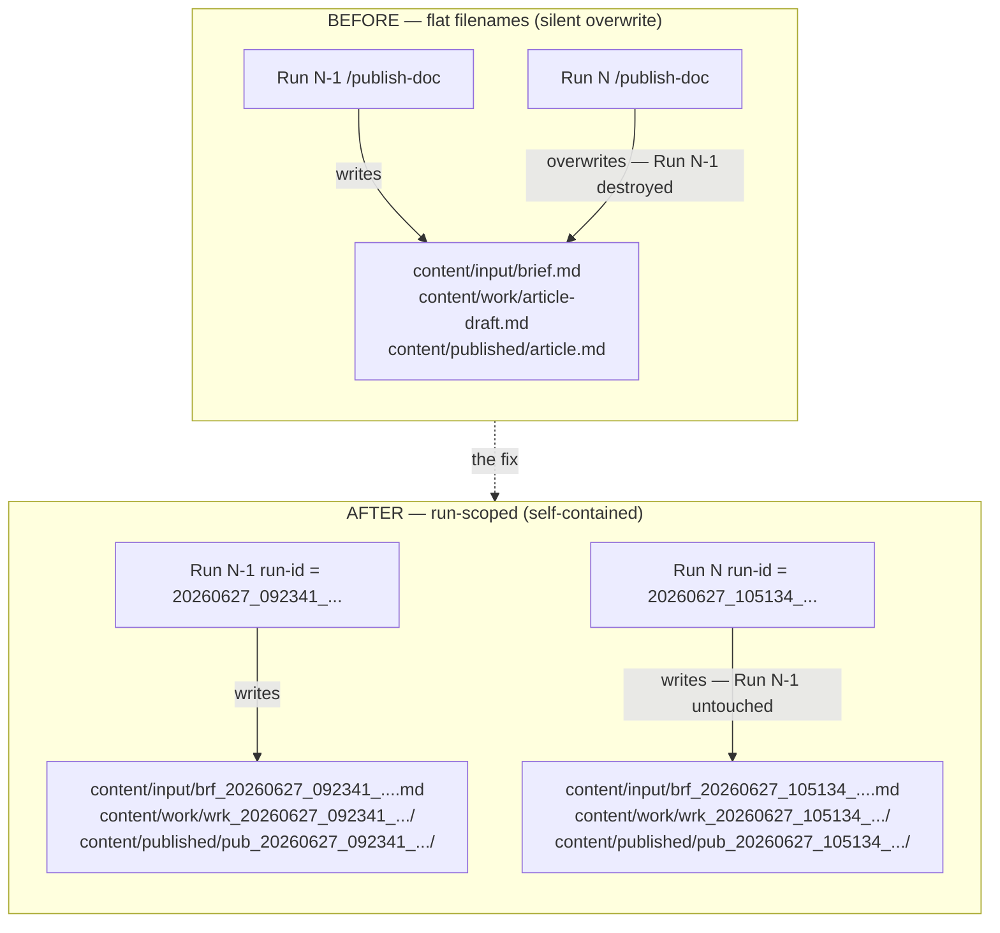
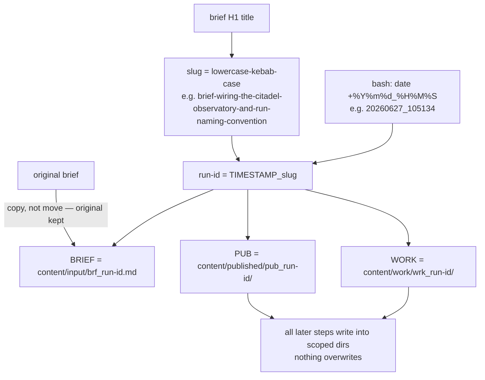
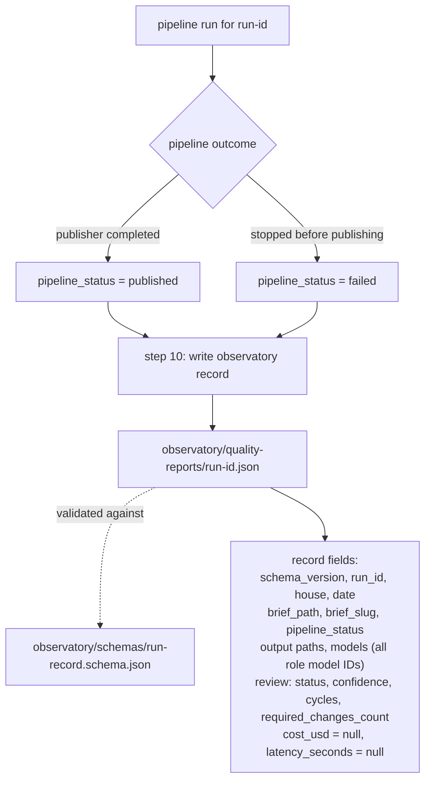

# Wiring The Citadel: Observatory Automation and Run-Scoped File Naming

## The Problem: Silent Overwrite and a Passive Observatory

The Citadel launched with an Observatory directory containing five empty data folders — `quality-reports/`, `cost/`, `latency/`, `evaluations/`, `metrics/` — and a README that said "keep this folder passive." The intent was right, but nothing actually filled it. No run wrote anything there. After two pipeline runs, neither had left a trace in the Observatory.

The same failure mode existed in `content/`. Every `/publish-doc` invocation wrote to the same three files: `brief.md`, `article-draft.md`, `article.md`. Run two overwrote run one completely. There was no history, no baseline, and no way to compare two runs side by side.

Both problems share one root cause: the pipeline had no concept of a run identity.



---

## The Fix: Run-Scoped Naming Convention

The fix is a naming convention enforced at step 1 of every pipeline invocation.

At the start of each run, the pipeline derives a stable run ID from two components: a timestamp from `date +%Y%m%d_%H%M%S` and a slug generated from the brief's H1 title (lowercase, non-alphanumeric replaced with hyphens, consecutive hyphens collapsed):

```text
TIMESTAMP=20260627_105134
SLUG=brief-wiring-the-citadel-observatory-and-run-naming-convention
RUN_ID=20260627_105134_brief-wiring-the-citadel-observatory-and-run-naming-convention
```

From that `RUN_ID`, three scoped paths are derived:

```text
BRIEF = content/input/brf_<run-id>.md
WORK  = content/work/wrk_<run-id>/
PUB   = content/published/pub_<run-id>/
```

Every step in the pipeline reads and writes through `$WORK` and `$PUB`. Nothing writes to a flat filename anymore. The original brief is copied to its stamped path but never deleted.

The result is visible in the repository right now. `content/published/` holds two intact directories:

```text
pub_20260627_092341_lab-note-building-the-citadel/
pub_20260627_105134_brief-wiring-the-citadel-observatory-and-run-naming-convention/
```

The same pattern was applied to the House of Personal Writing. `create-personal-piece.md` runs the same step 1. The standalone `review-personal-piece.md` and `publish-personal-piece.md` commands accept the `wrk_*` path as `$ARGUMENTS`, falling back to the most recently modified directory if none is provided.

Migrating the existing flat files reconstructed timestamps from their last-modified times. No content was lost.



---

## Observatory Automation: What the Run Record Captures

Step 10 of `publish-doc.md` fires unconditionally — whether the pipeline succeeded or failed at step 7. It writes a JSON record to:

```text
observatory/quality-reports/<run-id>.json
```

The record is defined by `observatory/schemas/run-record.schema.json`. Fields written per run:

- `house` — which pipeline produced the record
- `date`, `run_id`, `brief_slug`, `brief_path` — run identity
- `pipeline_status` — `"published"` or `"failed"`
- `output` — paths to `article.md`, `publish-manifest.json`, `release-notes.md`; all `null` if the pipeline failed before step 9
- `models` — model ID per role (writer, illustrator, reviewer, editor, publisher)
- `review.status`, `review.confidence`, `review.cycles`, `review.summary`, `review.required_changes_count` — pulled from `$WORK/review-result.json`
- `cost_usd`, `latency_seconds` — both `null`; those fields require API instrumentation that does not exist yet

The `models` and `output` objects use `additionalProperties` in the schema, so both houses write to the same schema without house-specific variants. A failed run is still recorded. An incomplete record with `pipeline_status: "failed"` and null outputs is valid data — it tells you the run happened, which review cycle it reached, and how confident the reviewer was before stopping.

The `schema_version` field is present on every record so future dashboard tooling can handle schema evolution without guessing.



---

## What Was Created and What Was Modified

**Files created:**

- `observatory/schemas/run-record.schema.json` — JSON Schema v2020-12 for observatory records
- `~/.claude/commands/brief.md` — global `/brief` skill; saves a Why/How/What session summary to `content/input/brf_<timestamp>_<slug>.md`

**Files modified:**

- `observatory/README.md` — now documents automated population, the field list, and dashboard readiness
- `houses/house-of-technical-publication/CLAUDE.md` — "Standard File Paths" replaced with "File Naming Convention" documenting `brf_`/`wrk_`/`pub_` prefixes
- `houses/house-of-technical-publication/.claude/commands/publish-doc.md` — step 1 (run ID) and step 10 (observatory write) added; all internal path references now use `$WORK` and `$PUB`
- `houses/house-of-personal-writing/CLAUDE.md` — same naming convention section added
- `houses/house-of-personal-writing/.claude/commands/create-personal-piece.md` — step 1 + step 11 observatory pattern
- `houses/house-of-personal-writing/.claude/commands/publish-personal-piece.md` — derives `PUB` from `$ARGUMENTS` or most recent `wrk_*`
- `houses/house-of-personal-writing/.claude/commands/review-personal-piece.md` — same fallback

**Files renamed (migration, no data lost):**

- `content/input/brief.md` → `content/input/brf_20260627_092341_lab-note-building-the-citadel.md`
- `content/work/*.md`, `review-result.json` → `content/work/wrk_20260627_092341_lab-note-building-the-citadel/`
- `content/published/*.md`, `publish-manifest.json` → `content/published/pub_20260627_092341_lab-note-building-the-citadel/`
- Personal writing: `content/input/brief.md` → `content/input/brf_20260627_075710_brief.md`

---

## Takeaway

The Observatory was passive because the pipeline had no run identity. Once you add a stable `RUN_ID` at step 1, everything downstream — file isolation, artifact paths, observatory records — becomes a naming problem, not an architecture problem. The `/brief` skill closes the remaining gap: it captures the session before it disappears into chat history and drops a stamped brief file directly onto the `/publish-doc` input path.
