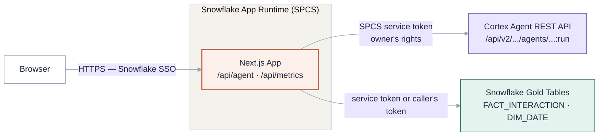
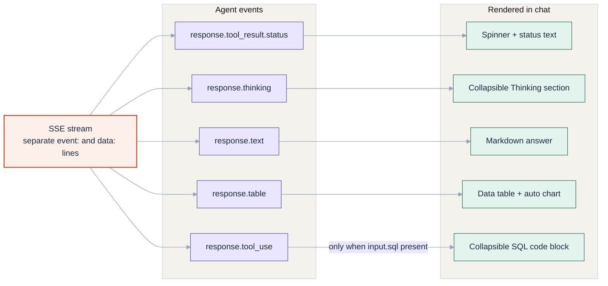
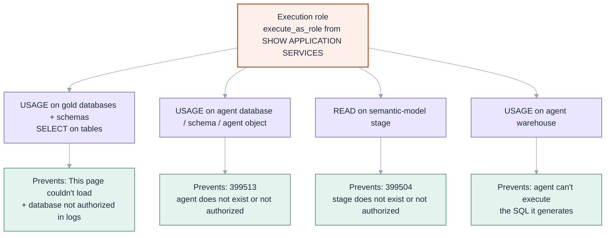

The first thing the Cortex Agent API ever said to me was `390142: Incoming request does not contain a valid payload`. The payload was right there — a question, a role, `stream: true`. Valid everything except the shape, which the error declined to mention. It set the tone for the whole UCCDE Intelligence Dashboard build: nothing on this stack fails loudly in a useful way.

## What the app actually is

The dashboard is a Next.js 16 app querying contact centre analytics across three platforms — AWS Connect, Genesys Cloud CX, and Avaya AXP Cloud. Each platform has its own gold-layer database — `UCCDE_VIV_CONNECT_GOLD`, `UCCDE_VIV_GENESYS_AU_GOLD`, `UCCDE_VIV_AVAYA_US_GOLD` — all sharing one star schema: `FACT_INTERACTION`, `DIM_DATE`. On top of the KPI cards sits a chat sidebar wired to `UCCDE_COMBINED_INTELLIGENCE_AGENT`, a Cortex Agent that answers natural-language questions across all three via text-to-SQL.

The whole thing deploys to Snowflake App Runtime — SPCS under the hood, SSO in front, a live `.snowflakecomputing.app` URL at the end. No separate hosting, no auth layer to build. I scaffolded from the official Next.js template: `lib/snowflake.ts` with SDK and REST auth helpers, shadcn/ui, Tailwind, TanStack Query.

**Runtime architecture: the browser reaches the Next.js app on Snowflake App Runtime (SPCS) over HTTPS with SSO, and the app fans out to the Cortex Agent REST API and the gold tables with three distinct auth flows.**



## The agent route, where the bodies are buried

The bridge is a single API route, `app/api/agent/route.ts`. It POSTs to the Cortex Agent REST API — `/api/v2/databases/.../agents/UCCDE_COMBINED_INTELLIGENCE_AGENT:run` — and streams the SSE response back to the browser. Two things in that route cost me real debugging time; both produced errors that told me almost nothing.

The first was the payload shape. The agent API rejects `content` as a plain string. It wants an array of typed blocks:

```json
{
  "role": "user",
  "content": [{ "type": "text", "text": "Your question here" }]
}
```

Send `"content": "Your question here"` and you get `390142`. The fix is one level of nesting. Finding that out is not one level of effort.

The second was authentication, and here's the wrong turn I'll own. My first instinct was to forward the caller's token — the `sf-context-current-user-token` header — so the agent would run as the signed-in user. It felt correct: per-user everything, least privilege. It is also not supported by the agent:run endpoint. You get back `390303: Invalid OAuth access token. null`, with the `null` doing a lot of heavy lifting. The working path is the SPCS service token — read from `/snowflake/session/token`, sent with `X-Snowflake-Authorization-Token-Type: OAUTH` — which authenticates as the app's execution role, owner's rights. Data routes can run per-user via `querySnowflake(sql, { callersRights: true })`; the agent API wants the service token, full stop.

## The chat that said nothing

Worse than any error was no error. The agent streams Server-Sent Events with separate `event:` and `data:` lines — `response.tool_result.status`, `response.thinking`, `response.text`, `response.table`, `response.tool_use`. My first parser assumed the OpenAI streaming shape, `delta.content[0].text`. Every event parsed fine. Nothing rendered. No exception, no console complaint — just a chat window that looked like the agent had nothing to say. I stared at a working stream and an empty UI for longer than I'd like to admit before questioning the assumption instead of the plumbing.

**How the chat UI maps each of the five Cortex Agent SSE event types to a rendered content block.**



The fix was to track the `event:` line and accumulate text per event type. That pushed the message model from `{ role, content: string }` into content blocks — text, thinking, status, table, sql — and that's what makes the rendering CoWork-style: the answer as markdown, reasoning in a collapsible gray section, a status spinner, result sets as tables, generated SQL in a collapsible code block.

One thing the agent will never do is hand you a chart. It returns `response.table` result sets and nothing more. So I wrote a client-side `ChatChart` component that inspects each table's columns and rows and auto-renders above it: a line chart when the first column is date-like with numeric columns and 3+ rows, a bar chart when it's categorical with 2–20 rows, nothing otherwise. Nobody types "show me a chart". The chart just appears when the data deserves one.

## Deploy day, and the role you didn't choose

Deploy itself is almost anticlimactic: `snow app setup` generates `snowflake.yml`, then `snow app deploy` uploads the source, runs `npm ci` and `next build` remotely on SPCS, and creates the Application Service. First deploy takes three to five minutes; after that, one or two.

Then the page loads and says "This page couldn't load".

The build guide flags this as the most common failure; it got me exactly as advertised. The app runs as its execution role — a role I never consciously chose — and that role starts with nothing. `SHOW APPLICATION SERVICES IN ACCOUNT` reveals it in the `execute_as_role` column. Then the grant chain: USAGE on the gold databases and schemas, SELECT on the tables; USAGE on the agent's database, schema, and the agent object itself (miss that and it's `399513: The agent does not exist or access is not authorized`); READ on the stage holding the semantic model YAML (miss that, `399504`); and USAGE on the agent's warehouse so it can run its generated SQL. The one mercy: each missing grant produces a different error, so you diagnose them one at a time.

**The execution-role grant chain: each missing grant surfaces as a different, diagnosable error.**



## What's still annoying

Locally, the agent route throws `390146: Bearer token is missing` because there's no `/snowflake/session/token` outside SPCS. Expected — it works after deploy — but it means the chat, the one component I most want to iterate on, is the one I can only test by deploying. Edit, `snow app deploy`, wait a minute, test the live URL. Judging by the error tables, the grant chain is the thing everyone hits. The app works locally, deploys cleanly, then can't see its own data. Every time.
