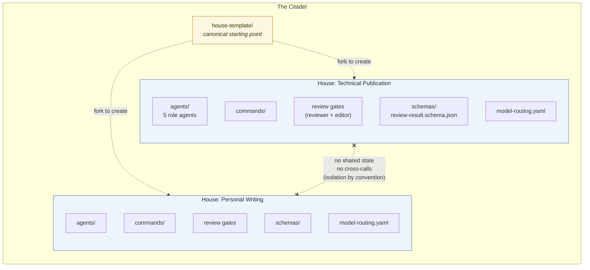
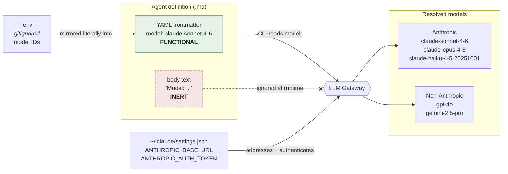
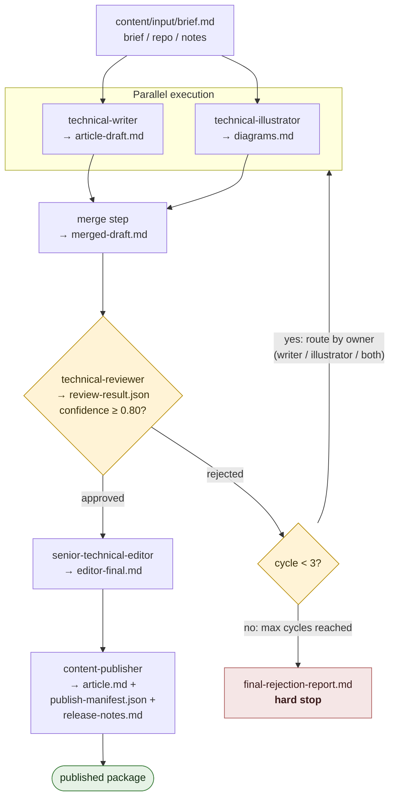

# Lab Note: Building The Citadel

## What It Is and Why the House Pattern

The Citadel is a monorepo of independent agent pipelines — each one called a House. The House of Technical Publication runs five agents in sequence: writer, illustrator, reviewer, editor, publisher. The House of Personal Writing runs a different set with different review criteria. Neither House knows the other exists. That isolation is enforced by convention, not code: each House has its own `.claude/agents/`, its own `model-routing.yaml`, its own `content/` directory, and its own review schema.

The pattern exists because shared state between pipelines is where configuration drift starts. If the technical reviewer and the tone reviewer share a schema file, one pipeline's evolution breaks the other's contract. Duplication here is cheaper than coupling.

`house-template/` is the canonical starting point. Copy it, rename it, wire the models, write the agents. It ships with a three-role default — creator, reviewer, publisher — and a `model-routing.yaml` mapping each role to an env key.



Every House holds the same five internal parts. The crossed link between Houses is deliberately not an arrow — there is no permitted path between them.

---

## How Model Routing Actually Works

Every agent routes through a single LLM gateway. The Claude CLI picks up `ANTHROPIC_BASE_URL` and `ANTHROPIC_AUTH_TOKEN` from `~/.claude/settings.json` and redirects all Anthropic SDK calls through the gateway. Non-Anthropic models — `gpt-4o`, `gemini-2.5-pro` — resolve through the same endpoint via model aliasing.

The gateway URL and auth token live in `~/.claude/settings.json`, not in any House's `.env`. Each House's `.env` (gitignored) holds only the model IDs — per-role assignments that differ between Houses.

Per-agent model assignment happens in YAML frontmatter:

```yaml
---
name: technical-reviewer
model: claude-opus-4-8
---
```

The Claude CLI reads `model:` from the frontmatter block. It does not read inline body text. A line like `Model: \`claude-opus-4-8\`` written in the agent's description body is parsed as prose and silently ignored at runtime. The agent falls back to whatever default the CLI uses. This distinction matters.

Model IDs use dashes, not dots: `claude-sonnet-4-6`, `claude-opus-4-8`, `claude-haiku-4-5-20251001`. Dotted variants like `claude-opus-4.8` will not resolve.

The full role-to-model mapping for the publication House, from `model-routing.yaml`:

```yaml
technical-writer:     claude-sonnet-4-6
technical-illustrator: gemini-2.5-pro
technical-reviewer:   claude-opus-4-8
senior-technical-editor: gpt-4o
content-publisher:    claude-haiku-4-5-20251001
fallback:             claude-opus-4-8
```



The dashed crossed line from body text is the failure mode caught during the build — a model declared only in body text is silently ignored. The gateway is the single egress point; the same two credentials route both Anthropic and non-Anthropic models.

---

## The Review Gate Contract

Every House has one reviewer. The reviewer outputs `content/work/review-result.json`. The schema is defined in `shared/schemas/review-result.schema.json` and requires three fields at the base level: `status` (`"approved"` or `"rejected"`), `confidence` (float 0–1), and `required_changes` (array). The pipeline will not proceed to the editor unless `status` is `"approved"` and `confidence >= 0.80`. After three failed cycles it produces `final-rejection-report.md` and stops.

The technical reviewer runs `claude-opus-4-8` at temperature 0.1, 7,000 max tokens — the quality gate, spend tokens there. The publisher runs `claude-haiku-4-5-20251001`; by the time work reaches it, decisions are made.

The base schema intentionally has no `additionalProperties: false` constraint. Each House extends it with domain-specific fields. The publication House adds `severity` per change item. The personal writing House adds `voice_match_score`, `audience_fit_score`, and `channel_fit_score`. The shared schema is a minimum contract, not a ceiling.



The only path to the editor is the `approved` edge from the reviewer. The rejection loop is explicit: rejected drafts re-enter parallel execution scoped to the owner named in `review-result.json`, and the cycle counter is what prevents an infinite loop.

---

## What Broke and What It Cost

**Bitbucket workspace name.** The Bitbucket remote was set up with the workspace name `vivanti` taken from a verbal value, rather than reading `~/.claude/settings.json`, where `BITBUCKET_WORKSPACE` was already set to `blusnow`. The push URL was wrong. Debugging took longer than it should have because the error surfaced downstream, not at configuration time. The value was always in settings.json; it just wasn't consulted.

**Agent model in body text, not frontmatter.** The House of Personal Writing originally carried model documentation inside the agent body — `Model: \`claude-opus-4-8\`` as formatted prose. That is inert. The CLI never sees it. The agents would have run on whatever the CLI default resolved to at runtime, with no error, no warning, and no indication the assignment was being skipped. Fixed by adding proper YAML frontmatter to all five agents.

**Three different review filenames.** Across the two Houses and an early draft of the template, the reviewer output file was named `review-report.json`, `tone-review.json`, and `review-result.json` at different points. The pipeline commands that read the file name it explicitly, so any mismatch silently produces a missing-file error at the next step. Standardized everything to `review-result.json`.

**Schema `additionalProperties: false`.** An early version of the shared base schema blocked any field not in the base definition. The personal writing House's `voice_match_score` and `channel_fit_score` were valid extensions — the schema refused them. Removed the constraint and documented the schema as a minimum contract. Houses can add fields; they cannot remove required ones.

**Parallel execution was optional, not enforced.** The original command said the writer and illustrator "may run in parallel." Sequential was easier, so that's what ran. Changed it to an explicit parallel task launch with a named merge step before the reviewer picks up `merged-draft.md`.

---

## One Concrete Takeaway

If you're building a multi-agent pipeline with Claude CLI, treat `~/.claude/settings.json` as the single source of truth for anything cross-project: gateway URL, auth token, workspace names, shared identifiers. Put per-pipeline values in each project's `.env`. Read from settings.json explicitly; do not rely on what someone said in chat or what's written in a comment. The gap between a verbally-stated value and the authoritative configured value is where drift lives, and drift in agent configuration fails silently at runtime — not at setup time.
