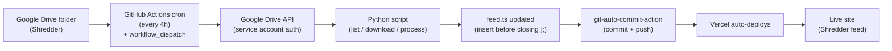
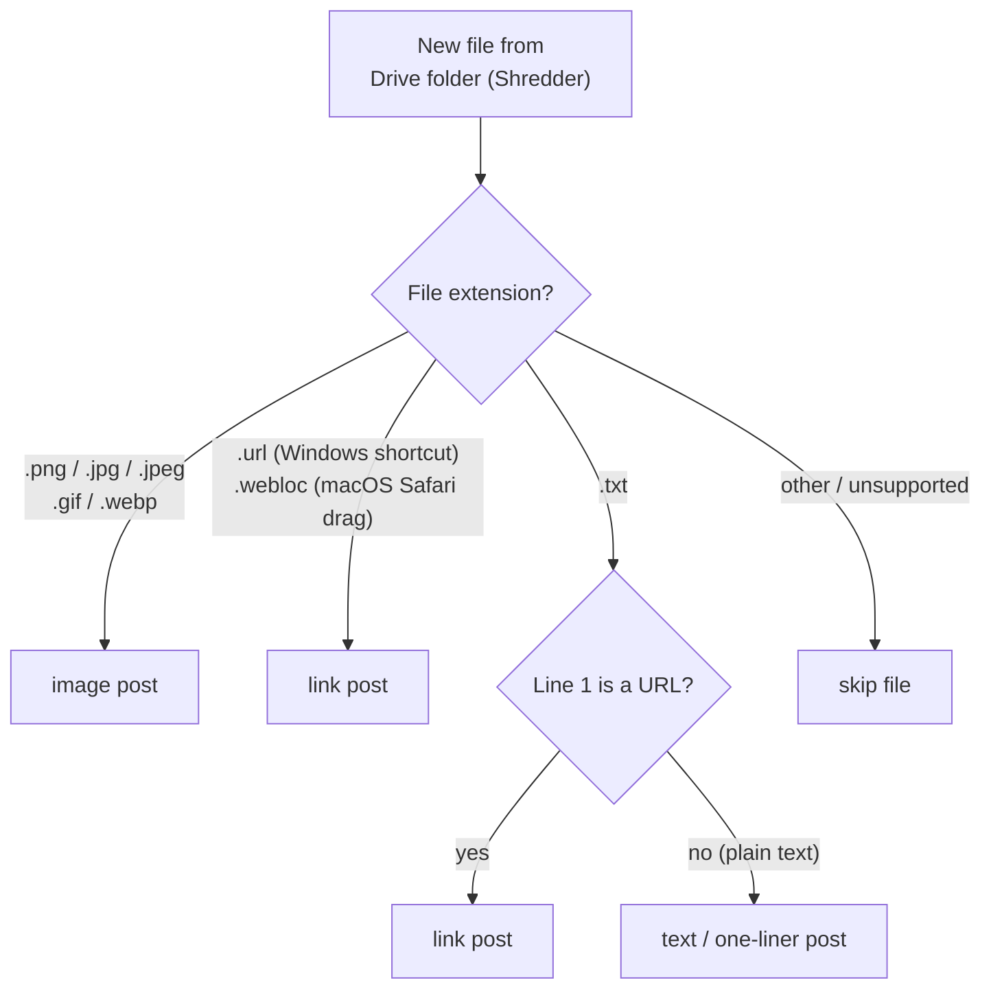
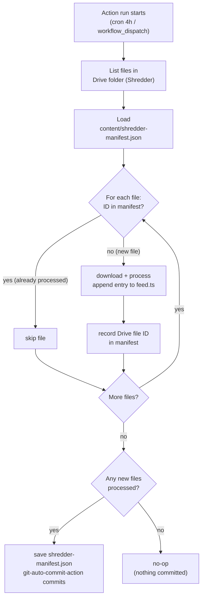

# Auto-Syncing Google Drive to a Next.js Feed with GitHub Actions

## What Shredder Is

I have a section on my site called Shredder. It is not a blog. There are no titles, no categories, no crafted narratives — just a reverse-chronological feed of screenshots I took, links I want to remember, and one-liners I would otherwise have dropped into a group chat and lost. Think of it as a self-hosted timeline I fully control.

The problem with running this manually is obvious the moment you try it. Every time I wanted to post a screenshot from my phone, the path was: screenshot → AirDrop → open VS Code → drag file → write TypeScript entry → commit → push → wait for Vercel. That is six steps too many for something that should feel like tweeting. I stopped posting within two weeks.

The fix was to remove myself from the loop entirely.

## The Architecture

A GitHub Actions workflow runs on a four-hour cron schedule. When it fires, a Python script authenticates against the Google Drive API using a service account, lists every file in my Shredder folder, skips anything already recorded in a local manifest, downloads the new files, appends the corresponding TypeScript entries to `feed.ts`, commits the changes, and pushes. Vercel picks up the push and deploys automatically. The manifest lives in the repo as `content/shredder-manifest.json`, so idempotency is just a file read.

No server. No Mac running in the corner. Nothing that breaks when I close my laptop.



## What You Can Drop In

The script classifies files by extension when it downloads them:

- `.png`, `.jpg`, `.jpeg`, `.gif`, `.webp` → image post. The file gets committed to `public/shredder/` and the entry points to it.
- `.url` (Windows shortcut) or `.webloc` (macOS Safari bookmark drag) → link post. The script parses the URL from the file body.
- `.txt` where line 1 starts with `http` → link post. Useful if you just want to paste a URL into a plain text file on mobile.
- `.txt` where line 1 is plain text → one-liner post. Whatever you typed becomes the content.

On mobile, this means I open the Google Drive app, tap the `+`, and either upload a screenshot directly or create a new document and paste a URL. That is the entire publishing workflow on my end.



## One-Time Setup

**1. Google Cloud — service account and key**

Create a project in [Google Cloud Console](https://console.cloud.google.com), enable the Google Drive API, and create a service account. Download its JSON key. The key is a blob that looks like `{"type":"service_account","project_id":...}`. Keep it out of version control.

**2. Share the Drive folder**

In Google Drive, right-click your Shredder folder, go to Share, and paste in the service account's email address (it looks like `name@project.iam.gserviceaccount.com`). Give it Viewer access. The folder ID is the string after `/folders/` in the URL — you'll need it in the next step.

**3. GitHub Secrets**

In your repo's Settings → Secrets → Actions, add two secrets:

- `GDRIVE_SERVICE_ACCOUNT` — the full contents of the JSON key file
- `GDRIVE_FOLDER_ID` — the folder ID string from the Drive URL

**4. Commit the workflow and script**

Once the workflow YAML and Python script are in the repo, Actions picks them up automatically. Nothing else to configure.

## The Workflow File

```yaml
name: Shredder Sync
on:
  schedule:
    - cron: "0 */4 * * *"
  workflow_dispatch:
jobs:
  sync:
    runs-on: ubuntu-latest
    steps:
      - uses: actions/checkout@v4
```

The full workflow adds `setup-python`, runs the sync script with the two secrets as env vars, and closes with `stefanzweifel/git-auto-commit-action@v5`. The auto-commit action only commits if files actually changed — if the sync found nothing new, no commit is created and the workflow exits cleanly. `workflow_dispatch` gives you a manual trigger in the Actions UI, which is useful when you want to test without waiting for the next cron window.

## The Python Script

The script has four responsibilities: authenticate, list, filter, and write.

**Auth** reads the service account JSON from the environment variable and constructs a Drive API client:

```python
import json, os
from pathlib import Path
from google.oauth2.service_account import Credentials
from googleapiclient.discovery import build

creds_data = json.loads(os.environ["GDRIVE_SERVICE_ACCOUNT"])
creds = Credentials.from_service_account_info(
    creds_data, scopes=["https://www.googleapis.com/auth/drive.readonly"]
)
service = build("drive", "v3", credentials=creds)
```

**List and filter** reads `content/shredder-manifest.json`, then lists files in the folder and skips any ID already in the manifest:

```python
manifest_path = Path("content/shredder-manifest.json")
seen = set(json.loads(manifest_path.read_text())) if manifest_path.exists() else set()

results = service.files().list(q=f"'{folder_id}' in parents").execute()
new_files = [f for f in results.get("files", []) if f["id"] not in seen]
```

**Write** appends new TypeScript object literals to `feed.ts`. The file has a named export that closes with `];`. The script finds the last occurrence of that closing bracket, inserts before it, and writes the file back. IDs are computed by scanning the existing file for the highest numeric `id:` value and incrementing from there — no database needed.

The manifest update is the last thing the script does, after all files are written successfully. If the script crashes mid-run, the manifest stays accurate and the next run retries only the unprocessed files.



## What Using It Actually Looks Like

Open Google Drive on your phone. Tap `+`. Upload a screenshot. Close the app.

Within four hours, the post is live. Tap the manual trigger in GitHub Actions and it is live in about thirty seconds.

The manifest at `content/shredder-manifest.json` is the only stateful piece — a flat JSON array of Drive file IDs, nothing else. To reprocess a file, delete its ID from the array and run the workflow again. To start completely fresh, delete the manifest file and the next run rebuilds it from scratch. The rest of the system has no memory of its own.
