I measured the gap. CTA bottom at y=782. Shredder "Show full timeline" at y=1129. That's 347 pixels of drift — the right column had been expanding unchecked every time a new image synced from Drive.

The Shredder lives in the hero's right column, 300px wide, showing the last few posts from the feed. Posts came in as images. Images stacked. The grid row was `items-stretch`, so whoever was taller won. The right column was winning by nearly 400px.

My first move was `overflow-hidden` on the column wrapper. Clip the content, stop the measurement, grid stays bounded. I added it, reloaded, measured again. Still blowing out to 1100px. The overflow clip had done nothing.

This is where I lost a few minutes. I assumed the problem was about rendering boundaries, not layout participation. `overflow: hidden` controls what you see, not how much space an element claims in a grid. The column was still telling the grid row "I am this tall" regardless of whether the content was visible. The Shredder was invisible past a certain point but was still dictating the row height at its full content height. Two different systems. I'd conflated them.

---

```mermaid
%%{init: {'theme': 'base', 'themeVariables': {'background': '#0d0d0d', 'primaryColor': '#1a1a1a', 'primaryTextColor': '#e5e5e5', 'primaryBorderColor': '#333333', 'lineColor': '#555555', 'secondaryColor': '#111111', 'tertiaryColor': '#111111', 'edgeLabelBackground': '#0d0d0d', 'clusterBkg': '#111111', 'clusterBorder': '#333333', 'titleColor': '#e5e5e5', 'nodeTextColor': '#e5e5e5', 'fontFamily': 'monospace'}}}%%
flowchart TB
    subgraph GRID["CSS Grid · grid-cols-2 · items-stretch"]
        direction TB

        subgraph LEFT["Left Column · flex flex-col · ~700px (height anchor)"]
            NAME["Name"]
            DESC["Description"]
            TAGS["Tech Tags"]
            CAROUSEL["LabCarousel ← structural ballast\nanchors left column to ~700px"]
            CTAS["CTA Buttons\n'Explore Deadlock Labs'\n'View Workbench'"]
            NAME --> DESC --> TAGS --> CAROUSEL --> CTAS
        end

        subgraph RIGHT["Right Column · h-full via items-stretch · matches left at ~700px"]
            subgraph SHREDDER["Shredder Box · h-full · flex flex-col"]
                HEADER["Panel Header"]
                subgraph POSTS["Posts Container · flex-1 min-h-0 overflow-hidden ← clips content"]
                    P1["Post 1 · 96×96 thumbnail"]
                    P2["Post 2 · 96×96 thumbnail"]
                    P3["Post 3 · 96×96 thumbnail"]
                    CLIP["· · · clipped — does not push grid row · · ·"]
                end
                TIMELINE["'Show full timeline'"]
                HEADER --> POSTS
                POSTS --> TIMELINE
            end
        end
    end

    NOTE1["overflow-hidden on column wrapper = clips render only\nlayout height still bleeds into grid row"]
    NOTE2["flex-1 min-h-0 overflow-hidden = clips layout\nposts surrender height to the flex parent"]

    style GRID fill:#0d0d0d,stroke:#333333,color:#e5e5e5
    style LEFT fill:#111111,stroke:#334455,color:#e5e5e5
    style RIGHT fill:#111111,stroke:#334455,color:#e5e5e5
    style SHREDDER fill:#0f1a0f,stroke:#2a3a2a,color:#e5e5e5
    style POSTS fill:#0a120a,stroke:#1e2e1e,color:#aaaaaa
    style CAROUSEL fill:#1a1f2e,stroke:#2a3a5a,color:#c8d4f0
    style CTAS fill:#1a1a2e,stroke:#2a2a5a,color:#c8c8f0
    style CLIP fill:#0a0a0a,stroke:#222222,color:#555555
    style NOTE1 fill:#1a0f0f,stroke:#3a2020,color:#cc8888
    style NOTE2 fill:#0f1a0f,stroke:#203a20,color:#88cc88
    style NAME fill:#111111,stroke:#333333,color:#cccccc
    style DESC fill:#111111,stroke:#333333,color:#cccccc
    style TAGS fill:#111111,stroke:#333333,color:#cccccc
    style HEADER fill:#0f1a0f,stroke:#2a3a2a,color:#cccccc
    style TIMELINE fill:#0f1a0f,stroke:#2a3a2a,color:#888888
    style P1 fill:#0a120a,stroke:#1e2e1e,color:#999999
    style P2 fill:#0a120a,stroke:#1e2e1e,color:#999999
    style P3 fill:#0a120a,stroke:#1e2e1e,color:#999999
```

The actual fix started a layer up — with where the LabCarousel was sitting. An earlier session had moved it outside the grid entirely. That session's problem was the carousel inflating the left column past some other threshold; pulling it out solved it then. But without the carousel, the left column became shorter than the right, and `items-stretch` started anchoring to the right instead. The carousel is the structural ballast. Name, description, tech tags, carousel, and CTA buttons together land around 700px — tall enough that the grid row anchors to the left, not the right.

Putting the carousel back into `hero.tsx` inside the left column div was the first commit (`def730e`). With that in place, `h-full` on the Shredder inner box and `flex-1 min-h-0 overflow-hidden` on the posts container did what I originally expected `overflow-hidden` to do — the Shredder now fills to the height the left column sets, not beyond it. Three posts at 96×96 thumbnails sits around 450px of content, well under the ~700px anchor. Second measurement: "Show full timeline" at y=762, CTAs at y=782. Twenty-one pixels off. I'll take it.

---

The image rendering was a separate problem that landed in the same commit window. Drive-synced posts don't carry a `linkTitle` — they come in with just an internal filename. The original card layout was thumb on the left, text on the right. With no `linkTitle`, the right side was blank. A small thumbnail next to empty space is worse than no thumbnail at all.

I split the render path. Posts with a `linkTitle` get the thumb-plus-text card. Posts without get a standalone 96×96 square, `object-cover`, nothing beside it. The second commit (`bb7d8b7`) also fixed the top padding — `pt-36` is 144px, the nav is `h-14` (56px), leaving 88px of dead air between the nav bottom and the first word. Dropped it to `pt-16/pt-20`.

---

The 21px gap between the timeline link and the CTA buttons is the thing I haven't fully resolved. It's close enough that nothing looks broken, but it's not exact. The left column height varies depending on how long the tech tag list wraps — more tags than usual shifts the carousel down, the whole column gets taller, and the Shredder has more room to fill. I haven't stress-tested this with a longer tag list on a narrower viewport.

The carousel-as-ballast approach works, but it's load-bearing in a way that isn't obvious from reading the JSX. If someone moves it out again to fix a future carousel problem, this one comes back.

---

tags: `hero-layout` `css-grid` `shredder` `next-js` `ui-fix` `flex`