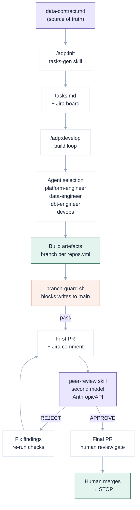

Data platform delivery has a reproducibility problem that does not come from the work being difficult. Ingesting a JSON event stream into Snowflake, building a dbt staging model, wiring up Bitbucket Pipelines — these are recognisable patterns. The problem is that the knowledge which makes them fast and safe lives in senior engineers: which schemachange version range a migration belongs in, when to use `merge` versus `append` in dbt, what the `branch-guard` should block, what a peer reviewer needs to flag as an error versus a warning. When those engineers are spread across engagements, or when a client needs to stand up a platform quickly, the tacit knowledge becomes the bottleneck.

`vivanti-adp` is an attempt to make that knowledge explicit enough for agents to execute reliably.

## What the system actually is

The project is a directory — a Claude Code knowledge base pointed at with `claude .`. It is not a runnable application. Claude Code reads `CLAUDE.md` on startup and the rest loads on demand as work requires.

```
vivanti-adp/
├── CLAUDE.md                    ← identity, routing, always-on policy imports
├── agents/                      ← craft knowledge per role
├── engagements/                 ← one folder per client engagement
├── skills/                      ← reusable workflows
├── knowledge/domain/            ← generic technical patterns
├── hooks/                       ← automation scripts
├── scripts/                     ← CLI utilities
└── memory/patterns/             ← promoted patterns (3x recurrence threshold)
```

The architecture principle behind this layout is deliberate: agents encode *how to do the work well*, engagements encode *what to build and for whom*, and skills encode *repeatable sequences that coordinate agents*. None of these concerns bleeds into another.

## Six agents, one data contract

The agent roster maps directly to the layers of a cloud-native data platform:

| Agent | Owns |
|---|---|
| Platform Engineer | Cloud infra, Terraform, compute, storage, networking |
| Data Engineer | Raw/landing DDL, schemachange migrations, Snowpipe, stages |
| dbt Engineer | Staging, silver, gold dbt models — transformation layer |
| DevOps | Bitbucket Pipelines, branching strategy, secrets, deployments |
| Technical Writer | README, data dictionary, Confluence docs, runbook |
| Report Developer | Semantic views, Cortex Analyst, dashboards, Snowflake Intelligence |

No agent loads unless it is explicitly activated. A session starts with `session-bootstrap.sh` printing active engagements, open task counts, and the available roster. From that point, the system routes based on what is asked — "As the Data Engineer, generate the landing DDL for the POS source" loads `agents/data-engineer.md`; nothing else changes.

The data contract at `engagements/{name}/data-contract.md` is the source of truth for every artefact. The Data Engineer does not write a single line of SQL until the contract's Source Schemas section is confirmed. The dbt Engineer does not build a staging model until the raw layer exists and the ingest count is greater than zero. The schemachange version range a migration falls into — V001 for raw DDL, V002 for ingest objects, V010+ for schema evolution — is determined by the contract, not the agent's judgement.

```
engagements/aurora-retail-au/
├── config/
│   ├── delivery.yml             ← git or file delivery mode
│   ├── repos.yml                ← repo slugs and clone URLs
│   ├── jira.yml                 ← project key, epic structure
│   └── confluence.yml           ← space key, doc set plan
├── context.md                   ← client, phase, stakeholders, decisions log
├── data-contract.md             ← source of truth — drives all artefact generation
├── repos.md                     ← repo split and ownership
└── artifacts/tasks.md           ← GENERATED by /adp:init — never hand-maintained
```

## The delivery lifecycle

Four slash commands cover the full engagement lifecycle in sequence:

```
/adp:discover  →  /adp:init  →  /adp:develop  →  /adp:document
```

`/adp:discover` runs `scripts/adp-discover.sh` — a read-only readiness check that validates the data contract, context, repos config, Jira credentials, and delivery mode before any artefact is generated. If any check fails, the session stops there.

`/adp:init` generates `tasks.md` from the data contract via the `tasks-gen` skill and mirrors it to Jira — project + epics + tasks, each with a Goal and Done-when. Tasks carry stable IDs (`T-001..T-NNN`) that persist across regenerations. DRAFT-status sources in the contract get exactly two tasks: confirm schema with client, flip status to CONFIRMED. No build tasks are generated for unconfirmed sources.

`/adp:develop` is the build loop. It picks the next eligible task by dependency order, loads the owning agent, generates artefacts, raises a first PR, routes it through independent peer review, fixes findings, and raises a second PR for human approval. The loop posts a Jira comment at every step — the audit trail is in the ticket, not in a terminal session that has already closed.

`/adp:document` publishes the Confluence doc set: architecture overview, data dictionary, runbook, and AI layer documentation. Diagrams are generated as draw.io XML when Confluence supports it, Mermaid otherwise.



## Quality gates: hooks and peer review

Three hooks enforce the guardrails that keep generated work auditable.

`hooks/branch-guard.sh` fires as a `PreToolUse` hook before any file write. If the target path is inside a client git repository and that repository is on `main` or `master`, the write is blocked and Claude is told to create a branch first. Writes inside the brain directory itself (`vivanti-adp`) are whitelisted — task state updates and memory writes must work regardless of branch.

```bash
# branch-guard.sh exit codes (Claude Code convention)
exit 0   # allow
exit 2   # BLOCK — stderr message fed back to Claude
```

`hooks/session-bootstrap.sh` runs at session start. It prints the current date, active engagements with phase and delivery mode, open task counts, and the loadable agent and skill roster. The output gives Claude the session context it needs without requiring the engineer to repeat it.

`hooks/track-decisions.sh` appends a row to the engagement's Known Issues / Decisions Log table in `context.md`. Architecture decisions, won't-fix rationales, and schema status changes land in the decisions log alongside the date and owning agent.

The peer-review skill routes completed artefacts to a second model before any branch is committed. The reviewer runs independently — a different model call with a different prompt, no shared context with the generator. The structured output format is fixed:

```
## PASS
[files with no issues]

## FINDINGS
- FILE: V002__aurora_pos_ingest_objects.sql
  SEVERITY: ERROR
  LINE/OBJECT: POS_TRANSACTIONS_PIPE
  ISSUE: AUTO_INGEST parameter missing — SQS notification will not trigger
  FIX: Add AUTO_INGEST = TRUE to the COPY INTO pipe definition

## VERDICT
APPROVE | APPROVE WITH WARNINGS | REJECT
```

A `REJECT` verdict halts the workflow with exit code 1. A `REJECT` finding is never silently dropped or overridden. The review output is saved to `artefacts/peer-review-{date}.md` as part of the audit trail.

## A real engagement: aurora-retail-au / LUMEN

The aurora-retail-au engagement (a workshop client) demonstrates the full stack from raw ingest to natural-language analytics. The data contract specifies two source systems: Aurora POS (hourly JSON export to S3 + SQS notification) and reference data (daily CSV drops for stores and products). Both flow through Snowpipe into a bronze layer, then through dbt staging → silver → Kimball star schema → Snowflake Semantic View → Cortex Agent → Snowflake Intelligence.

```mermaid
%%{
  init: {
    'theme': 'base',
    'themeVariables': {
      'background': '#f9f8f4',
      'primaryColor': '#ffffff',
      'primaryTextColor': '#1e293b',
      'primaryBorderColor': '#e2e8f0',
      'lineColor': '#94a3b8',
      'secondaryColor': '#eae6ff',
      'tertiaryColor': '#e2f4ed'
    }
  }
}%%
flowchart LR
    POS["Aurora POS\nJSON hourly"] -->|S3 + SQS| SP1["Snowpipe\nauto-ingest"]
    REF["Stores + Products\nCSV daily"] -->|S3 + SQS| SP2["Snowpipe\nauto-ingest"]

    SP1 --> BRZ["AURORA_LUMEN_BRONZE\nappend-only VARIANT"]
    SP2 --> BRZ

    BRZ --> STG["dbt staging\nflatten, type, canonical names"]
    STG --> SLV["Silver\ndedup, SCD2 prep"]
    SLV --> GLD["Gold\nKimball star schema"]

    GLD --> SEM["LUMEN_SALES\nSemantic View"]
    SEM --> AGT["LUMEN_ANALYST\nCortex Agent"]
    AGT --> SI["Snowflake Intelligence\nnatural-language Q&A"]

    style BRZ fill:#fdf0eb,stroke:#bc5a3a,stroke-width:1px
    style GLD fill:#e2f4ed,stroke:#2f6d54,stroke-width:1px
    style AGT fill:#eae6ff,stroke:#5c51a4,stroke-width:1px
```



The Data Engineer generates the bronze DDL using `schemachange` versioned migrations. Every raw table is append-only. Every row gets a SHA-256 surrogate key from `METADATA$FILENAME` concatenated with `METADATA$FILE_ROW_NUMBER`. Every ingest object references `AUTO_INGEST = TRUE` and points to the SQS ARN from the data contract's Source System section. The peer reviewer checks all of this before the branch is committed.

The dbt Engineer picks up from a confirmed handoff — "raw table exists, ingest is live, DEV count is greater than zero" — and builds staging models that flatten the VARIANT payload into typed columns with canonical names. Silver handles deduplication and SCD2 preparation for the reference entities. Gold is a Kimball star: `fact_sales_line`, `dim_store`, `dim_product`, `dim_date`, `dim_time`, `dim_payment_method`.

The Report Developer builds a `CREATE SEMANTIC VIEW LUMEN_SALES` on the gold star, a Cortex Search service over `dim_product` for grounding product questions, and a Cortex Agent named `LUMEN_ANALYST` that uses both. The acceptance bar is three business questions answered correctly from synthetic data before the session closes.

## What held up

The separation between planning and implementation was non-negotiable to get right before anything else. When a single model call handles both — deciding what to build and then building it — the plan exists only in the model's context and there is nothing to audit, review, or hand back. Separating them forces the plan into `tasks.md`, which is reviewable, mirrored to Jira, and survives session boundaries.

The harder problem was context at agent boundaries. An agent handed a task with underspecified context — no data contract section cited, no schema status confirmed, no delivery mode checked — either fails visibly or generates artefacts that satisfy the letter of the task but miss the intent. Getting the data contract structured well enough that downstream agents do not need to reinterpret it took longer than any single agent implementation.

The peer-review skill works because the reviewer model is independent. When the generator and reviewer share the same context, the reviewer tends to confirm the generator's assumptions. Running them as separate API calls — different system prompts, no shared history — surfaces the assumptions the generator made and did not surface itself.

## What the system does not do

The develop command never merges. It never approves its own pull request. It never transitions a Jira issue to Done autonomously. Human approval gates sit at branching, review, and merge — the three moments where a decision made incorrectly is expensive to reverse. Automation handles the repeatable work between those decisions. The model does not compress the feedback loop on decisions that still require judgement.
