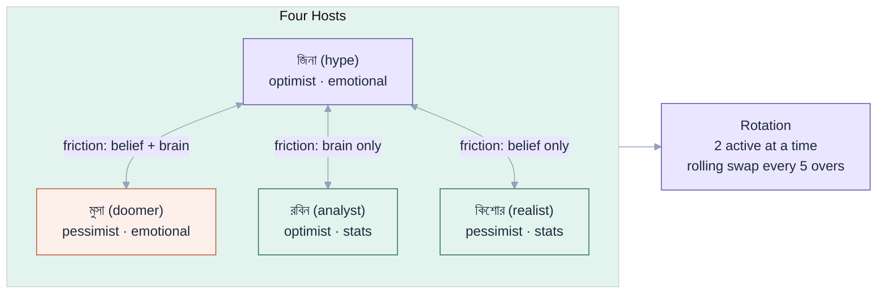
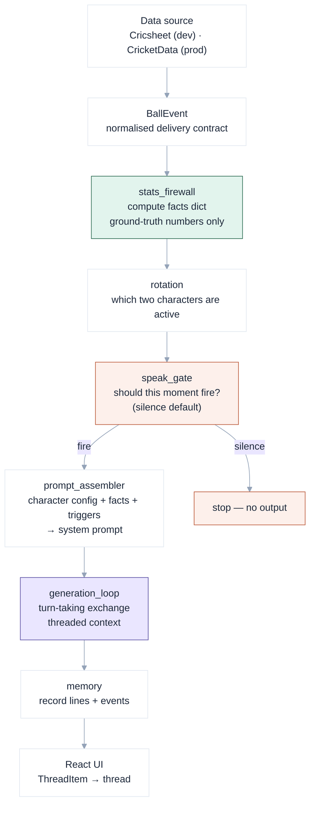

GallerySide started from a specific frustration: most AI-generated cricket commentary reads like a scorecard with adjectives. It knows the numbers, but it does not have an opinion. It does not have friends. It does not let a moment breathe.

The goal was a system where four Bangladeshi cricket fans — with distinct beliefs, vocabularies, and axes of disagreement — host a live thread for a Bangladesh match in Bangla. Two of them are on air at a time. They rotate. They argue. They occasionally agree. And they go quiet on deliveries that do not earn a response.

## What the system actually is

GallerySide is a Python backend (12 modules, 107 tests) paired with a React/Vite frontend. The backend is a linear pipeline — no orchestrator, no parallel branches, no dynamic routing. One ball event flows through one sequence of modules and either produces a commentary exchange or produces nothing.

```
galleryside-repo/
├── src/
│   ├── ball_event.py          ← normalised delivery contract (source-agnostic)
│   ├── stats_firewall.py      ← ground-truth numbers; LLM cites only these
│   ├── rotation.py            ← which two characters are active and when to swap
│   ├── speak_gate.py          ← should this moment trigger commentary at all
│   ├── prompt_assembler.py    ← character config + match context → system prompt
│   ├── generation_loop.py     ← turn-taking exchange, threading context per turn
│   ├── memory.py              ← within-match lines + cross-match character notes
│   ├── escalation.py          ← how long an exchange runs (stakes × friction)
│   ├── orchestrator.py        ← wires the pipeline together
│   ├── cricsheet_adapter.py   ← dev data source (offline JSON)
│   ├── cricketdata_adapter.py ← prod data source (live API)
│   └── characters/            ← one .md file per character (YAML frontmatter + lore)
└── ui/                        ← React/Vite thread renderer
```

The two data adapters share one output shape: `BallEvent`. The pipeline never knows which adapter produced it. Source selection is config-driven and has no effect on any downstream module.

## The four characters

The cast is fixed. Character identity lives in per-character markdown files — YAML frontmatter carries the operational fields (id, belief, brain, register, voice\_rules, vocabulary, first\_message), and the prose body is lore for humans that the pipeline ignores at runtime. Adding a character is dropping a new file into `src/characters/`.

| ID | Display Name | Belief | Brain | Reference |
|---|---|---|---|---|
| `hype` | জিনা | optimist | emotional | Tony Greig |
| `doomer` | মুসা | pessimist | emotional | — |
| `analyst` | রবিন | optimist | stats | — |
| `realist` | কিশোর | pessimist | stats | — |

The four characters produce two axes of tension. Belief (optimist ↔ pessimist) drives the most friction. Brain (emotional ↔ stats) produces a quieter but real contrast — the analyst and the hype see the same moment differently even when they agree on the outcome. The rotation friction rule means the two active characters are never alike on both axes simultaneously.

জিনা speaks fast Cholito Bangla with GenZ English for emphasis — "main character energy", "it's giving", "iconic." She addresses co-hosts by name with তুমি. মুসা is the doomer. রবিন reaches for numbers. কিশোর reacts from feel. Each voice rule and vocabulary list lives in config; none of it is hardcoded.



## The pipeline

Every delivery travels the same linear sequence. Nothing branches. Nothing retries autonomously. A module either passes its output forward or returns nothing, which stops the delivery there.



### BallEvent — the contract

`BallEvent` is a frozen dataclass that both adapters produce and all downstream modules consume. It is the only place where source-specific knowledge lives — wides and no-balls carry an `is_legal_ball` property so over/ball arithmetic downstream is never a guess. The `commentary` field is `Optional[str]`; Cricsheet has none, CricketData does. The Tier-2 speak gate degrades gracefully to silence on absent commentary without any special-casing.

`team_runs_after` and `team_wickets_after` are embedded in the event as ground truth. The stats firewall reads from these, not from a running accumulator it maintains itself.

### Stats firewall — the anti-hallucination contract

`compute_facts(state: InningsState) -> dict` takes the current innings state and returns a typed facts dict. The LLM receives this dict with a hard instruction: cite only these numbers. Any number not in the dict is not available — the character speaks without it rather than guessing.

The firewall outputs eight derived values:

| Key | Description |
|---|---|
| `score` | `runs/wickets` |
| `wickets` | wickets fallen |
| `overs` | `over.ball` label |
| `current_run_rate` | CRR to 2dp |
| `projected_score` | CRR × overs remaining |
| `runs_needed` | second innings only |
| `balls_remaining` | second innings only |
| `required_run_rate` | second innings only |

Fields absent from the state are absent from the dict — they are never fabricated. A character who reaches for `required_run_rate` in the first innings gets `(no numbers available yet)`.

### Speak gate — silence by default

The speak gate receives a `BallEvent` and decides whether this delivery earns commentary. The default answer is silence. Three tiers run in order:

**Tier 1** — free hard-event rules. Wicket, four, six, boundary all fire unconditionally regardless of match state. A single conditional check, no LLM, no cost.

**Tier 2** — keyword prose scan on `commentary` text. Checks for trigger words that indicate a near-miss, dropped catch, review, or dramatic moment. Degrades gracefully to silence when `commentary` is `None` (Cricsheet path).

**Tier 3** — pluggable LLM classifier callback. Disabled by default. When enabled, runs only on deliveries that cleared Tier 1 and Tier 2 without firing, for edge-case drama detection. The callback is injected — a fake returns `False` in tests so the test suite runs offline and at zero cost.

`SpeakGate.evaluate()` returns a `Trigger` enum value or `None`. `None` means silence. The orchestrator does not pass `None` results downstream.

### Rotation — friction as a design constraint

`RotationManager` tracks which two characters are active and when to swap. The validity rule is enforced at the pair level: `is_valid_pair(a, b)` returns `True` only if the two characters differ on at least one axis — belief or brain. A pair that agrees on both axes is never active. This guarantees some tension is always present.

The rolling swap fires every 5 overs: one character stays, the other is replaced by the next eligible character. The swap candidate is picked by cycling the roster and checking pair validity. Death overs (overs 16–20 in T20) freeze the active pair — no mid-death rotation. An innings-break panel runs all four characters before rotation restarts for the second innings.

An injected RNG makes rotation deterministic in tests: the test suite passes a seeded `random.Random` and the sequence is reproducible without mocking the rotation logic itself.

### Escalation — stakes × friction = exchange length

`exchange_length(cast, pair, triggers)` returns how many turns an exchange runs. The base is 2 turns. A wicket or high-drama trigger adds stakes weight. Opposed-belief pairs (the highest-friction pairing) add a friction multiplier. A wicket between জিনা and মুসা — the optimist-pessimist emotional pair — earns the longest exchange. A boundary between রবিন and কিশোর earns the shortest. The result is capped, and the cap is a parameter.

The stakes weight uses the maximum trigger that fired, not the sum. A wicket and a four on the same ball is a wicket.

### Generation loop — threading context

`GenerationLoop.run_exchange(moment, prior_lines)` alternates speaker and partner for the escalated turn count. Each turn:

1. Assembles a `PromptContext` with speaker\_id, partner\_id, facts, triggers, and the last 6 lines of the running thread.
2. Calls `build_system_prompt(cast, ctx)` — character voice rules, vocabulary, the firewall facts dict, the "cite only these numbers" instruction, and the recent thread as visible context.
3. Calls `client.generate(system_prompt)` — the injected LLM client (real API or scripted fake).
4. Appends the new line and swaps speaker ↔ partner.

The context window is bounded at 6 prior lines. This is a deliberate choice: long context lets characters reference things said 40 deliveries ago, but it also makes them repeat earlier reactions. The 6-line window keeps continuity while forcing fresh takes.

### Memory — two timescales

`MatchMemory` is transient: lines spoken and key events for the current match. It also implements repetition detection — if a candidate line has a similarity ratio above 0.85 against any of the last 12 lines, it is flagged as a repeat before display.

`CrossMatchStore` is persistent: per-character notes that survive between matches, backed by a pluggable `Storage` protocol. A `dict` satisfies the protocol in tests; a JSON file or database satisfies it in production. Character identity — voice, essence, register — is never written to the persistent store. The store holds only mutable notes. Personality drift through storage is structurally prevented.

## Test coverage

107 tests, all runnable offline. The LLM client is a scripted fake that returns fixed strings, so generation tests are deterministic and free. The stats firewall has a full invariant test: every output field for both innings is checked against known inputs, and any unknown input produces absent fields, never defaults. The speak gate tests cover each tier independently, including the Tier-2 graceful-silence path on absent commentary. Rotation tests use a seeded RNG to verify pair sequences, death-over freezes, and innings-break behaviour reproducibly.

## What the system does not do

GallerySide does not predict match outcomes. It does not maintain a world model of the match independent of the `BallEvent` stream — if the data source sends a wrong number, the firewall repeats that wrong number faithfully. The LLM never originates a figure that was not computed from the event. The system does not speak unless the moment earns it, and it does not decide what a moment means — the speak gate decides whether it fires, and the character voices decide how they react to what they are told happened.
