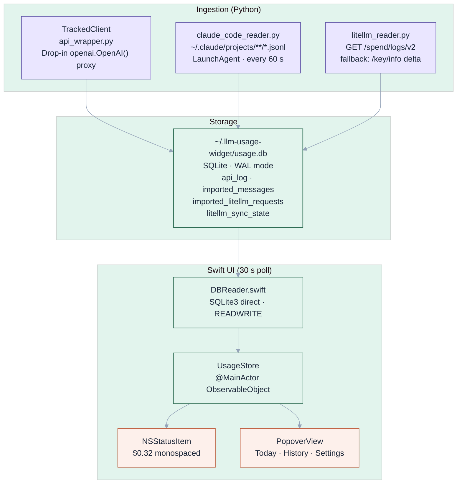
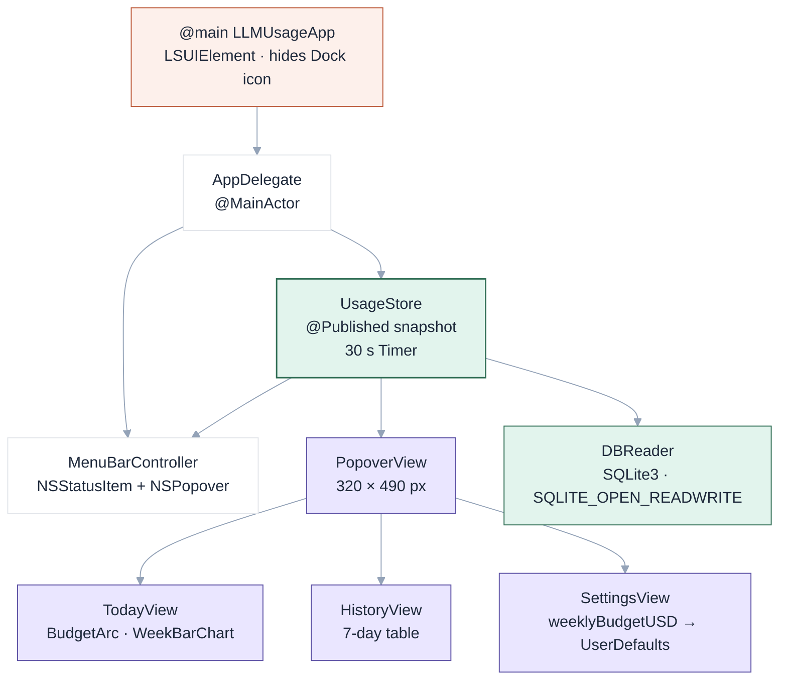

There is a number I want to see without opening a browser: what has today's LLM usage cost so far? Not the billing cycle — today. The number should update without me asking and it should aggregate across every tool I am using.

`llm-usage-widget` is that number in the menu bar.

## What it does

A macOS `NSStatusItem` shows a monospaced cost figure — `$0.32` — or a dash when nothing has been logged yet. Clicking it opens a 320×490 popover with three tabs: Today, History, and Settings. Today shows the current spend, a budget arc, and a 7-day bar chart. History shows a scrollable 7-day table. Settings lets you set a weekly budget threshold that drives the arc's colour ramp from green to amber to red.

Everything the UI shows comes from a single SQLite database at `~/.llm-usage-widget/usage.db`. The database is written by Python; the Swift app reads it. The two processes share no memory, no IPC, no network — the file is the interface.

## Architecture



Three ingestion paths, one store, one reader, one UI. No coordination needed between the Python processes because SQLite serialises writes and WAL mode allows concurrent reads.

## The two ingestion paths

### Path 1 — TrackedClient

For any code I write that calls an LLM, `TrackedClient` is a drop-in replacement for `openai.OpenAI()`:

```python
from llm_widget.api_wrapper import TrackedClient

client = TrackedClient()   # reads LLM_GATEWAY_URL + LLM_GATEWAY_KEY from .env
response = client.chat.completions.create(
    model="claude-sonnet-4-6",
    messages=[{"role": "user", "content": "..."}],
)
# row written to api_log automatically — no other change required
```

The proxy chain is three thin classes. `_TrackedCompletions.create()` calls the real OpenAI client, extracts `response.usage`, estimates cost, and calls `log_api_call()` before returning. The caller never knows anything was intercepted.

### Path 2 — Claude Code JSONL harvester

Claude Code writes every session to `~/.claude/projects/**/*.jsonl`. Each line is a JSON object. Assistant messages with non-zero token usage carry an `"usage"` block with `input_tokens`, `output_tokens`, `cache_read_input_tokens`, and `cache_creation_input_tokens`.

`claude_code_reader.py` walks all JSONL files, extracts those records, estimates cost, and writes to the database. It skips `"<synthetic>"` model strings (Claude Code's internal bookkeeping messages) and enforces idempotency through a UUID lookup table — `imported_messages` holds every `"uuid"` already processed, so reruns never double-count.

A LaunchAgent fires this every 60 seconds:

```xml
<key>StartInterval</key>
<integer>60</integer>
<key>ProgramArguments</key>
<array>
  <string>/opt/homebrew/bin/python3.11</string>
  <string>-c</string>
  <string>from llm_widget.claude_code_reader import scan_and_import; scan_and_import()</string>
</array>
```

No daemon process, no socket, no polling loop — just `launchctl` scheduling a one-shot Python invocation at a fixed interval.

### LiteLLM gateway (on demand)

`litellm_reader.py` hits the gateway's `/spend/logs/v2` endpoint, paginates through all records for the current billing period using `MAX(start_time)` from the database as a cursor, and inserts new rows with `INSERT OR IGNORE` to handle any overlap. When `/spend/logs/v2` fails on page 1, it falls back to `/key/info`: reads the total `spend` field, subtracts the last stored baseline from `litellm_sync_state`, and logs the delta as a single aggregate row.

## The pricing engine

Cost estimation happens in Python at write time — every `api_log` row carries a precomputed `cost_usd`. The pricing table is a dictionary keyed on model-string prefixes, matched longest-first:

```python
# "claude-sonnet-4-6" → matches "claude-sonnet-4", not "claude-sonnet"
for prefix in sorted(MODEL_PRICING, key=len, reverse=True):
    if model.startswith(prefix):
        return MODEL_PRICING[prefix]
```

The Swift layer carries an identical table in `PricingTable.swift`. Both are updated together when providers change pricing — the dual maintenance is intentional: the Swift table supports future client-side recalculation without re-importing historical rows.

Twenty models across four providers are covered. Fallback for unknown model strings is GPT-4.1 pricing — a reasonable mid-tier assumption that fails loudly enough to notice if a new model prefix slips through.

## The WAL gotcha

SQLite's Write-Ahead Logging mode maintains a `-wal` sidecar file alongside the main database. Even a reader must participate in WAL checkpointing, which requires writing to the shared-memory (`-shm`) file. Opening the database with `SQLITE_OPEN_READONLY` in Swift produces an error at `sqlite3_open_v2`.

`DBReader.swift` opens with `SQLITE_OPEN_READWRITE`:

```swift
guard sqlite3_open_v2(path, &db, SQLITE_OPEN_READWRITE, nil) == SQLITE_OK else {
    throw DBError.openFailed(msg)
}
```

This is the least obvious constraint in the whole system. It looks wrong — a reader component using a write flag — but it is the documented requirement for WAL. Changing it back to `READONLY` silently breaks reads on a live database.

## The Swift layer



`UsageStore` is a `@MainActor ObservableObject` that owns a 30-second `Timer`. On each tick it calls `DBReader` for three queries — today's aggregate, the weekly aggregate, and the 7-day daily breakdown — assembles a `UsageSnapshot` value type, and publishes it. The menu bar title and every UI component derive from that single snapshot.

`DBReader` uses the `libsqlite3` system framework directly — no third-party ORM. Its public API mirrors `db.py` function-for-function: `todaySummary()` runs the same SQL as `get_api_summary_today()`, `weeklySummary()` runs the same SQL as `get_weekly_summary()`. The billing period boundary — Monday 00:00 UTC — is computed identically in both languages: Python uses `timedelta(days=now_utc.weekday())`, Swift uses `Calendar(identifier: .iso8601)` with `timeZone: UTC`.

`BudgetArc` is the signature visual: a 270-degree stroke arc that fills proportionally to weekly spend versus the budget threshold. The fill colour follows a three-tier risk ramp — emerald below 50%, amber 50–80%, red above 80% — implemented as a `switch` on the fraction in `DesignTokens.swift`. The same ramp drives the progress bar below it.

## What held up

Keeping the pricing table in sync across two languages is the dullest ongoing maintenance cost. It is also the right call — the alternative (having Swift call Python at render time) adds process coordination complexity for no observable benefit. Two files, one update.

The billing period boundary took longer than expected to get right. LiteLLM resets on Monday UTC. In UTC+10, that is Monday 10:00 AM local. The Python and Swift implementations compute this differently (weekday arithmetic vs ISO 8601 calendar) but must produce the same boundary — otherwise the weekly aggregate differs between what the gateway reports and what the UI shows. The fix was anchoring both to UTC explicitly rather than letting either side use local time.

Running the sync as a one-shot LaunchAgent rather than a persistent daemon was the right call from the start. A daemon adds restart logic, health checks, and log rotation. A LaunchAgent with `StartInterval: 60` gives the same effective behaviour with zero infrastructure to maintain. If the sync fails, it just logs to `/tmp/llm-usage-sync-error.log` and tries again in 60 seconds.
